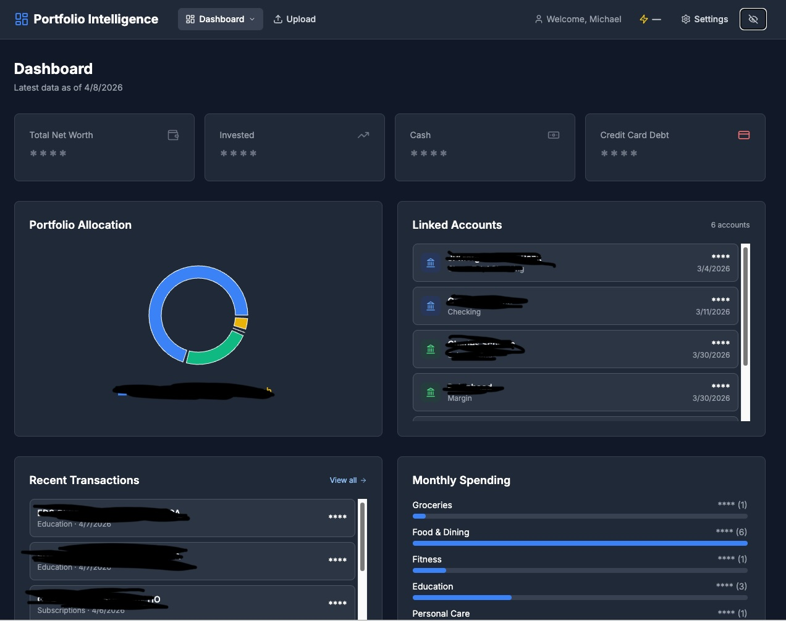

# Personal Finance — Portfolio Intelligence

<div align="center">

[](https://github.com/nimbusNova/personal_finance/actions/workflows/ci.yml)
[](https://nextjs.org/)
[](https://www.typescriptlang.org/)
[](https://sqlite.org/)
[](https://bun.sh/)
[](#ai-providers)
[](LICENSE)

**PDF-first portfolio tracking with AI-powered suggestions.**  
*Runs locally on your machine with Next.js full-stack (API Routes + SQLite).*

> Single `bun run dev` runs everything. Supports Kimi, OpenAI, Anthropic, Google, and Groq — bring your own API key.

[Quick Start](#quick-start) • [Docker](#-running-with-docker) • [Features](#features) • [Architecture](#architecture) • [Documentation](#documentation) • [Contributing](#contributing)

</div>



---

## 🌟 Features

### 📊 Portfolio Intelligence
- **Unified Net Worth View** — Aggregate holdings across all brokers, banks, and credit cards in one dashboard
- **PDF-First Data Ingestion** — Upload brokerage, bank, and credit card statements; Kimi AI parses them into structured data
- **Diversity & Risk Analysis** — Understand concentration risk by asset class, sector, geography, and individual position
- **Portfolio Snapshots** — Track your portfolio's evolution over time with point-in-time records

### 🤖 AI-Powered Suggestions
- **Explainable Recommendations** — Every suggestion includes detailed reasoning (market context, life-stage fit, tax implications)
- **Life-Stage Adaptive** — The AI adjusts recommendations based on your age, income, risk tolerance, and goals
- **Decision Trail** — Persistent record of AI suggestions, your feedback, and outcomes

### 💰 Spending Analysis
- **Transaction Categorization** — Automatic categorization from credit card and bank statements
- **Recurring Charge Detection** — Identify subscriptions and recurring payments
- **Expense Analysis** — Track spending patterns and expensive transactions

### 📈 Monthly Reports
- **Beautiful Dashboard** — Interactive monthly report summarizing portfolio changes, spending, and AI insights
- **Export Capabilities** — JSON/CSV exports for further analysis

---

## 🚀 Quick Start

Two ways to run — pick whichever fits:

### Option A: Docker (recommended, no setup required)

**Requirements:** [Docker Desktop](https://www.docker.com/products/docker-desktop/)

```bash
# 1. Download the compose file (no repo clone needed)
curl -O https://raw.githubusercontent.com/nimbusNova/personal_finance/main/docker-compose.hub.yml

# 2. Set your AI key and start
KIMI_API_KEY=your-key-here docker compose -f docker-compose.hub.yml up
# → App: http://localhost:3000
# → Data persists in a Docker volume across restarts
```

No Bun, Node, or SQLite installation needed. Your financial data is stored in a Docker-managed volume on your machine.

### Option B: Native (for developers)

**Requirements:** [Bun](https://bun.sh/) 1.0+

```bash
# 1. Clone the repository
git clone https://github.com/nimbusNova/personal_finance.git
cd personal_finance

# 2. Install dependencies
cd web && bun install

# 3. Configure your AI provider
cp .env.example .env
# Edit .env and add your API key — or configure via Settings UI after first start

# 4. Start
bun run dev
# → App: http://localhost:3000
# → Data stored in web/data/ (gitignored)
```

---

## 🏗️ Architecture

```
┌─────────────────────────────────────────────┐
│           Next.js 14 Full-Stack             │
│  ┌─────────────────────────────────────┐    │
│  │         React UI (App Router)       │    │
│  │    Pages + Server Components        │    │
│  └─────────────────────────────────────┘    │
│  ┌─────────────────────────────────────┐    │
│  │      API Routes (/api/v1/*)         │    │
│  │  22 endpoints: portfolio, holdings, │    │
│  │  uploads, transactions, settings... │    │
│  └─────────────────────────────────────┘    │
│              │                              │
│  ┌───────────┴───────────┐                  │
│  ▼                       ▼                  │
│  ┌──────────┐    ┌──────────────┐          │
│  │  SQLite  │    │  AI Provider │          │
│  │ (better- │    │  Kimi/OpenAI │          │
│  │ sqlite3) │    │  /Anthropic… │          │
│  └──────────┘    └──────────────┘          │
│                                              │
│  Local data dir: web/data/                   │
│  • personal_finance.db (auto-init)           │
│  • pdfs/  • logs/  • settings.json           │
└─────────────────────────────────────────────┘
```

### Tech Stack
| Layer | Technology |
|-------|-----------|
| **Framework** | Next.js 14 (App Router), React, TypeScript |
| **Runtime** | Bun |
| **Database** | SQLite via `better-sqlite3` with Drizzle ORM |
| **ORM** | Drizzle Kit + Drizzle ORM |
| **AI** | Multi-provider — Kimi, OpenAI, Anthropic, Google, Groq (configurable) |
| **Testing** | Jest (Bun test runner) |
| **Styling** | Tailwind CSS |

### Data Flow
1. **Upload** — Drag & drop PDF statements (brokerage, bank, credit card)
2. **Classify** — AI identifies document type from PDF text (known institutions skip AI entirely via dedicated parsers)
3. **Extract** — Two-pass extraction for brokerage (holdings list + account metadata), single-pass for bank/credit card
4. **Repair** — JSON sanitization and AI-driven repair for malformed responses
5. **Validate** — Holdings sum ≈ total ± 1%, no negative quantities, year inference
6. **Persist** — Upsert institutions, accounts, snapshots, holdings, transactions, balances
7. **Visualize** — Interactive dashboard with portfolio summary, spending analysis, monthly reports

---

## 🐳 Running with Docker

### Quickest path — pull from Docker Hub (no clone)

```bash
# Download the compose file
curl -O https://raw.githubusercontent.com/nimbusNova/personal_finance/main/docker-compose.hub.yml

# Run with your API key
KIMI_API_KEY=your-key docker compose -f docker-compose.hub.yml up -d

# Open the app
open http://localhost:3000

# Stop
docker compose -f docker-compose.hub.yml down
```

Your data (SQLite database + uploaded PDFs) is stored in a named Docker volume called `personal_finance_data`. It survives container restarts and `down/up` cycles. To delete all data: `docker volume rm personal_finance_data`.

### Build locally (from cloned repo)

```bash
git clone https://github.com/nimbusNova/personal_finance.git
cd personal_finance
cp web/.env.example web/.env  # add your API key
docker compose up --build -d
```

### Environment variables in Docker

Pass any AI provider key via the environment or a `.env` file:

```bash
# Kimi (default)
KIMI_API_KEY=sk-... docker compose -f docker-compose.hub.yml up

# OpenAI
AI_PROVIDER=openai OPENAI_API_KEY=sk-... docker compose -f docker-compose.hub.yml up

# Anthropic
AI_PROVIDER=anthropic ANTHROPIC_API_KEY=sk-ant-... docker compose -f docker-compose.hub.yml up
```

Or create a `.env` file next to `docker-compose.hub.yml`:
```
KIMI_API_KEY=sk-...
```

The image is automatically rebuilt and published to [Docker Hub](https://hub.docker.com/r/nimbusnova123/personal-finance) on every push to `main`.

---

## 🤖 AI Providers

The app supports multiple AI providers — set `AI_PROVIDER` in your `.env` (or via the Settings UI):

| Provider | Env Var | Notes |
|----------|---------|-------|
| **Kimi** (default) | `KIMI_API_KEY` | Best price/performance for long PDFs |
| **OpenAI** | `OPENAI_API_KEY` | GPT-4o / GPT-4o-mini |
| **Anthropic** | `ANTHROPIC_API_KEY` | Claude models |
| **Google** | `GOOGLE_API_KEY` | Gemini models |
| **Groq** | `GROQ_API_KEY` | Fast inference |

Known institutions (Robinhood, Chase, Schwab, Wealthfront) are parsed **without AI** using deterministic parsers — instant and free.

See [`.env.example`](web/.env.example) for full configuration options.

---

## 🧪 Testing

```bash
cd web
bun run test        # All tests
bun run test -- --testPathPatterns="lib/"   # Lib tests only
bun run test -- --coverage                   # With coverage report
```

**Current Test Status:** 46/46 passing ✅

---

## 📚 Documentation

- **[Product Requirements (PRD)](docs/PRDs/PRD-Personal-Finance-Portfolio-Intelligence-v1.md)** — Full product specification with phased roadmap
  - Phase I: Personal Usage (current)
  - Phase II: Publishable Product
  - Phase III: Advanced / Enterprise
- **[Entity Relationship Diagram](docs/ERD.md)** — Database schema and relationships
- **[Implementation Plan](docs/IMPLEMENTATION_PLAN.md)** — Technical implementation details

---

## 🛡️ Security & Privacy

- **Local-First**: All data stored locally in SQLite; no cloud database required
- **API Key Security**: API keys stored in `web/data/settings.json` or `.env` (both gitignored)
- **No Telemetry**: No analytics, tracking, or data collection
- **PDF Storage**: PDFs stored locally in `web/data/pdfs/` (gitignored)
- **No Authentication**: Single-user local app; no login required

**Before going to production:**
1. Build with `bun run build` and deploy with `bun run start`
2. Enable HTTPS
3. Consider migrating from SQLite to PostgreSQL for multi-user scenarios

---

## 🗺️ Roadmap

### Current (Phase I) ✅
- [x] PDF-based data ingestion
- [x] Local SQLite storage
- [x] AI-powered suggestions
- [x] Monthly reports
- [x] Portfolio tracking
- [x] Spending analysis

### Phase II (Planned)
- [ ] Direct API connections (Plaid, Alpaca, etc.)
- [ ] Automated data sync
- [ ] Mobile app (React Native)
- [ ] Multi-user support
- [ ] PostgreSQL support

### Phase III (Future)
- [ ] Tax optimization suggestions
- [ ] Monte Carlo retirement simulations
- [ ] Rebalancing automation
- [ ] Advanced portfolio optimization

---

## 🤝 Contributing

Contributions are welcome! This is a personal finance tool that can benefit from community input.

### Development Setup

```bash
# Fork and clone
git clone https://github.com/your-username/personal_finance.git
cd personal_finance/web
bun install
```

### Pull Request Process
1. Fork the repository
2. Create a feature branch (`git checkout -b feature/amazing-feature`)
3. Make your changes
4. Run tests (`cd web && bun run test`)
5. Commit your changes (`git commit -m 'Add amazing feature'`)
6. Push to the branch (`git push origin feature/amazing-feature`)
7. Open a Pull Request

### Areas for Contribution
- **New Broker Support**: PDF parsers for additional brokerage statements
- **AI Prompts**: Improved suggestion prompts and reasoning
- **UI/UX**: Dashboard enhancements and visualizations
- **Testing**: Additional test coverage
- **Documentation**: Tutorials, guides, and examples

---

## 💬 Support

- **Issues**: [GitHub Issues](https://github.com/nimbusNova/personal_finance/issues)
- **Discussions**: [GitHub Discussions](https://github.com/nimbusNova/personal_finance/discussions)

---

## ❤️ Sponsor

If this project saves you time or money, consider supporting its development:

[](https://github.com/sponsors/nimbusNova)

---

## 🙏 Acknowledgments

- **[Kimi AI](https://www.moonshot.cn/)** by Moonshot — default AI provider for PDF extraction
- **[Drizzle ORM](https://orm.drizzle.team/)** — Type-safe SQLite queries
- **[Next.js](https://nextjs.org/)** — Frontend framework
- **[Bun](https://bun.sh/)** — JavaScript runtime and package manager

---

## 📄 License

This project is licensed under the MIT License — see the [LICENSE](LICENSE) file for details.

---

<div align="center">

**Built with ❤️ for personal finance enthusiasts**

[⬆ Back to Top](#personal-finance--portfolio-intelligence)

</div>
