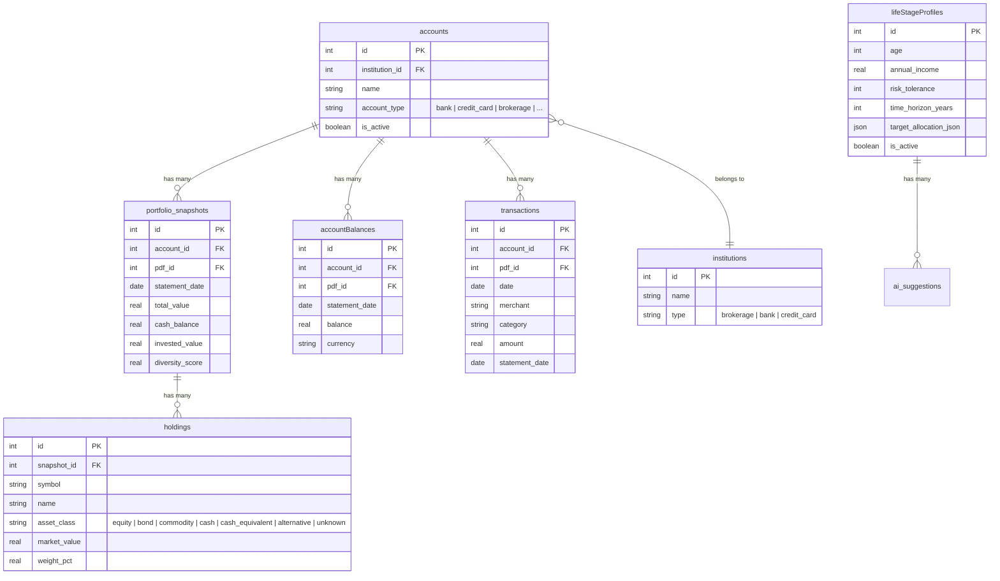

# ERD: Trends Page — Historical Portfolio & Spending Analysis

**Version:** 1.0  
**Date:** 2026-04-24  
**Status:** Draft  
**Stack:** Next.js 14, better-sqlite3, Drizzle ORM, TypeScript, Recharts

---

## 1. Entity Relationship Diagram

The Trends page is a **read-only aggregation** over existing tables. No new entities are required.



### 1.1 Relationship Summary for Trends

| Parent | Child | Cardinality | FK | Purpose in Trends |
|--------|-------|-------------|----|-------------------|
| `accounts` | `portfolio_snapshots` | 1:N | `account_id` | Brokerage account values over time |
| `accounts` | `accountBalances` | 1:N | `account_id` | Bank balances (+) and credit card debt (−) |
| `accounts` | `transactions` | 1:N | `account_id` | Spending grouped by category & month |
| `portfolio_snapshots` | `holdings` | 1:N | `snapshot_id` | Asset class allocation per snapshot |
| `accounts` | `institutions` | N:1 | `institution_id` | Institution metadata (not directly queried) |
| `lifeStageProfiles` | *(none for read)* | — | — | Target allocation JSON for overlay line |

### 1.2 No Schema Changes Required

The Trends feature performs **server-side aggregation only** against existing tables. No migrations, no new columns, no new indexes are strictly necessary. Existing indexes already cover the query patterns:

| Index | Covers |
|-------|--------|
| `idx_snapshots_account (account_id, statement_date DESC)` | Net worth & allocation history |
| `idx_holdings_snapshot (snapshot_id)` | Holdings per snapshot |
| `uix_balance_account_date (account_id, statement_date)` | Latest balance lookup |
| `idx_transactions_date (date DESC)` | Spending trend time-range filter |
| `idx_transactions_category (category)` | Spending group-by category |

---

## 2. Implementation Plan

### Phase 1: Backend API — `/api/v1/trends` (2–3h)

**File:** `web/app/api/v1/trends/route.ts`

```
GET /api/v1/trends?start_date=ISO&end_date=ISO
```

**Returns:**
```json
{
  "netWorth": [
    { "date": "2025-10-15", "netWorth": 145000.00, "investedValue": 120000.00 }
  ],
  "allocation": [
    { "date": "2025-10-15", "equity": 65.2, "bond": 20.0, "commodity": 5.0, "cash": 9.8, "alternative": 0, "unknown": 0 }
  ],
  "spending": [
    { "year": 2025, "month": 10, "category": "Dining", "total": 450.20, "count": 12 }
  ]
}
```

**Steps:**
1. Parse `start_date` and `end_date` query params (optional; default to all data).
2. Run three aggregation queries (see §3 Query Reference).
3. Merge snapshot dates with account balance dates for net worth (exact-match or closest-prior logic).
4. Normalize allocation rows into percentage records per date.
5. Return with `jsonResponse()` wrapper.

### Phase 2: Frontend — `web/app/trends/page.tsx` (4–5h)

**Page structure:**
```
web/app/trends/page.tsx
├── TimeRangeSelector        # 1M | 3M | 6M | 1Y | YTD | All
├── TrendKeyMetrics          # 4 × StatCard with period-over-period deltas
├── NetWorthSection
│   └── NetWorthChart        # Recharts LineChart
├── AllocationSection
│   └── AllocationHistoryChart  # Recharts AreaChart (stacked)
└── SpendingSection
    └── SpendingTrendChart   # Recharts BarChart (grouped/stacked)
```

**Steps:**
1. Create `web/app/trends/page.tsx` — page shell with `Navbar`, state for `timeRange`.
2. Create `TimeRangeSelector` component — button group, computes `startDate`/`endDate`.
3. Create `TrendKeyMetrics` — fetches `/api/v1/trends`, computes deltas from first/last data point, renders 4 `StatCard`s.
4. Create `NetWorthChart` — `LineChart` with `ResponsiveContainer`, custom tooltip (dark theme).
5. Create `AllocationHistoryChart` — `AreaChart` with `stackId="a"` for each asset class; reuse `COLOR_MAP` from `AllocationChart.tsx`.
6. Create `SpendingTrendChart` — `BarChart` with stacked bars per category; sort legend by total amount.
7. Wire `usePrivacy()` for amount masking.
8. Add empty states for each section.

### Phase 3: Navigation & API Client (0.5h)

1. Add `{ href: '/trends', label: 'Trends', icon: TrendingUp }` to `dashboardSubItems` in `Navbar.tsx`.
2. Add `getTrends(startDate?: string, endDate?: string)` to `web/lib/api.ts`.

### Phase 4: Testing & Polish (2h)

| Test | How |
|------|-----|
| Empty state | Test with no snapshots / no transactions |
| Single data point | Net worth dot, allocation pie fallback |
| Time range filter | Verify 1M/3M/6M/1Y/YTD/All compute correct dates |
| Responsive | Mobile 375px, tablet 768px, desktop 1024px |
| Build | `npm run build` zero errors |
| Privacy mode | Verify `formatCurrencyPrivate` masks amounts |

### Estimated Effort

| Phase | Hours |
|-------|-------|
| Backend API | 2–3 |
| Frontend page + charts | 4–5 |
| Navigation + API client | 0.5 |
| Testing & polish | 2 |
| **Total** | **~9–11 hours** |

---

## 3. Query Reference

All queries use Drizzle ORM with `better-sqlite3`. The `db` client is imported from `@/lib/db/client`.

### 3.1 Net Worth Aggregation

```typescript
// web/app/api/v1/trends/route.ts
import { eq, sql, and, gte, lte } from 'drizzle-orm';
import { db } from '@/lib/db/client';
import * as schema from '@/lib/db/schema';

// --- 1. Snapshot totals per statement date ---
const snapshotRows = db
  .select({
    date: schema.portfolioSnapshots.statementDate,
    totalValue: sql<number>`SUM(${schema.portfolioSnapshots.totalValue})`.as('total_value'),
    investedValue: sql<number>`SUM(${schema.portfolioSnapshots.investedValue})`.as('invested_value'),
  })
  .from(schema.portfolioSnapshots)
  .where(
    and(
      startDate ? gte(schema.portfolioSnapshots.statementDate, new Date(startDate)) : undefined,
      endDate ? lte(schema.portfolioSnapshots.statementDate, new Date(endDate)) : undefined
    )
  )
  .groupBy(schema.portfolioSnapshots.statementDate)
  .all();

// --- 2. Account balances per statement date, joined with account type ---
const balanceRows = db
  .select({
    date: schema.accountBalances.statementDate,
    accountType: schema.accounts.accountType,
    total: sql<number>`SUM(${schema.accountBalances.balance})`.as('total'),
  })
  .from(schema.accountBalances)
  .innerJoin(schema.accounts, eq(schema.accountBalances.accountId, schema.accounts.id))
  .where(
    and(
      startDate ? gte(schema.accountBalances.statementDate, new Date(startDate)) : undefined,
      endDate ? lte(schema.accountBalances.statementDate, new Date(endDate)) : undefined
    )
  )
  .groupBy(schema.accountBalances.statementDate, schema.accounts.accountType)
  .all();

// --- 3. Merge into netWorth array ---
// Build a map of date -> { netWorth, investedValue }
const netWorthMap = new Map<string, { netWorth: number; investedValue: number }>();

for (const row of snapshotRows) {
  const d = row.date.toISOString().split('T')[0];
  const existing = netWorthMap.get(d) || { netWorth: 0, investedValue: 0 };
  existing.netWorth += row.totalValue || 0;
  existing.investedValue += row.investedValue || 0;
  netWorthMap.set(d, existing);
}

for (const row of balanceRows) {
  const d = row.date.toISOString().split('T')[0];
  const existing = netWorthMap.get(d) || { netWorth: 0, investedValue: 0 };
  if (row.accountType === 'bank') {
    existing.netWorth += row.total || 0;
  } else if (row.accountType === 'credit_card') {
    existing.netWorth -= row.total || 0;
  }
  netWorthMap.set(d, existing);
}

const netWorth = Array.from(netWorthMap.entries())
  .map(([date, vals]) => ({ date, ...vals }))
  .sort((a, b) => a.date.localeCompare(b.date));
```

> **Note on date alignment:** Snapshot dates and account balance dates may not perfectly align. The above uses exact dates. For a given date, if snapshots exist but no account balance is present, the frontend can show an info tooltip: "Net worth excludes bank/credit accounts with no statement on this date."

### 3.2 Allocation by Asset Class Over Time

```typescript
// Allocation: sum marketValue per (snapshot date, assetClass)
const allocationRows = db
  .select({
    date: schema.portfolioSnapshots.statementDate,
    assetClass: sql<string>`COALESCE(${schema.holdings.assetClass}, 'unknown')`.as('asset_class'),
    totalValue: sql<number>`SUM(${schema.holdings.marketValue})`.as('total_value'),
  })
  .from(schema.holdings)
  .innerJoin(
    schema.portfolioSnapshots,
    eq(schema.holdings.snapshotId, schema.portfolioSnapshots.id)
  )
  .where(
    and(
      startDate ? gte(schema.portfolioSnapshots.statementDate, new Date(startDate)) : undefined,
      endDate ? lte(schema.portfolioSnapshots.statementDate, new Date(endDate)) : undefined
    )
  )
  .groupBy(schema.portfolioSnapshots.statementDate, schema.holdings.assetClass)
  .all();

// Normalize to percentage per date
const assetClasses = ['equity', 'bond', 'commodity', 'cash', 'cash_equivalent', 'alternative', 'unknown'];
const allocationByDate = new Map<string, Map<string, number>>();
const dateTotals = new Map<string, number>();

for (const row of allocationRows) {
  const d = row.date.toISOString().split('T')[0];
  const ac = row.assetClass || 'unknown';
  const val = row.totalValue || 0;

  if (!allocationByDate.has(d)) allocationByDate.set(d, new Map());
  const dateMap = allocationByDate.get(d)!;
  dateMap.set(ac, (dateMap.get(ac) || 0) + val);
  dateTotals.set(d, (dateTotals.get(d) || 0) + val);
}

const allocation = Array.from(allocationByDate.entries())
  .map(([date, classMap]) => {
    const total = dateTotals.get(date) || 1;
    const row: Record<string, number | string> = { date };
    for (const ac of assetClasses) {
      row[ac] = Math.round(((classMap.get(ac) || 0) / total) * 10000) / 100;
    }
    return row;
  })
  .sort((a, b) => (a.date as string).localeCompare(b.date as string));
```

### 3.3 Spending by Category Over Time

```typescript
// Spending: sum amount per (year, month, category)
const spendingRows = db
  .select({
    year: sql<number>`strftime('%Y', ${schema.transactions.date})`.as('year'),
    month: sql<number>`strftime('%m', ${schema.transactions.date})`.as('month'),
    category: sql<string>`COALESCE(${schema.transactions.category}, 'Uncategorized')`.as('category'),
    total: sql<number>`SUM(${schema.transactions.amount})`.as('total'),
    count: sql<number>`COUNT(*)`.as('count'),
  })
  .from(schema.transactions)
  .where(
    and(
      startDate ? gte(schema.transactions.date, new Date(startDate)) : undefined,
      endDate ? lte(schema.transactions.date, new Date(endDate)) : undefined
    )
  )
  .groupBy(
    sql`strftime('%Y', ${schema.transactions.date})`,
    sql`strftime('%m', ${schema.transactions.date})`,
    schema.transactions.category
  )
  .all();

// The frontend can pivot this flat list into grouped bar chart data.
// Each unique (year, month) becomes a bar group; each category is a segment.
const spending = spendingRows.map((row) => ({
  year: row.year,
  month: row.month,
  category: row.category,
  total: Math.round((row.total || 0) * 100) / 100,
  count: row.count,
}));
```

---

## 4. Raw SQL Equivalents

For reference, the Drizzle queries above translate to the following SQLite SQL:

### 4.1 Net Worth

```sql
-- Snapshot totals per date
SELECT statement_date,
       SUM(total_value)   AS total_value,
       SUM(invested_value) AS invested_value
FROM portfolio_snapshots
WHERE statement_date BETWEEN ? AND ?
GROUP BY statement_date;

-- Account balances per date, with type
SELECT ab.statement_date,
       a.account_type,
       SUM(ab.balance) AS total
FROM account_balances ab
JOIN accounts a ON ab.account_id = a.id
WHERE ab.statement_date BETWEEN ? AND ?
GROUP BY ab.statement_date, a.account_type;
```

### 4.2 Allocation History

```sql
SELECT ps.statement_date,
       COALESCE(h.asset_class, 'unknown') AS asset_class,
       SUM(h.market_value) AS total_value
FROM holdings h
JOIN portfolio_snapshots ps ON h.snapshot_id = ps.id
WHERE ps.statement_date BETWEEN ? AND ?
GROUP BY ps.statement_date, h.asset_class;
```

### 4.3 Spending Trend

```sql
SELECT strftime('%Y', date) AS year,
       strftime('%m', date) AS month,
       COALESCE(category, 'Uncategorized') AS category,
       SUM(amount) AS total,
       COUNT(*) AS count
FROM transactions
WHERE date BETWEEN ? AND ?
GROUP BY strftime('%Y', date), strftime('%m', date), category;
```

---

## 5. Data Flow

```
┌─────────────────────────────────────────────────────────────────────┐
│                         TRENDS PAGE                                  │
│  TimeRangeSelector ──► /api/v1/trends?start_date=X&end_date=Y       │
└─────────────────────────────────────────────────────────────────────┘
                              │
                              ▼
┌─────────────────────────────────────────────────────────────────────┐
│                    Next.js API Route                                 │
│  ┌──────────────┐  ┌─────────────────┐  ┌─────────────────────────┐ │
│  │  Net Worth   │  │   Allocation    │  │       Spending          │ │
│  │  Query       │  │   Query         │  │       Query             │ │
│  │              │  │                 │  │                         │ │
│  │ snapshots    │  │ snapshots +     │  │ transactions            │ │
│  │   totalValue │  │   holdings      │  │   GROUP BY Y-M-category │ │
│  │ + bank bal   │  │   assetClass    │  │                         │ │
│  │ - cc debt    │  │   marketValue   │  │                         │ │
│  └──────────────┘  └─────────────────┘  └─────────────────────────┘ │
└─────────────────────────────────────────────────────────────────────┘
                              │
         ┌────────────────────┼────────────────────┐
         ▼                    ▼                    ▼
  ┌──────────────┐    ┌──────────────┐    ┌──────────────┐
  │ portfolio_   │    │   holdings   │    │ transactions │
  │ snapshots    │    │              │    │              │
  └──────────────┘    └──────────────┘    └──────────────┘
         │
         ▼
  ┌──────────────┐
  │ account_     │
  │ balances     │◄───┐
  └──────────────┘    │
         ▲            │
         └────────────┘
         accounts (account_type)
```

---

## 6. Key Decisions

| Question | Decision |
|----------|----------|
| New tables? | **None.** Trends is read-only aggregation. |
| Single or multiple API endpoints? | **Single** `/api/v1/trends` — one request, simpler frontend. |
| Date alignment strategy? | Exact statement dates. Partial coverage documented in tooltip. |
| Net worth formula? | `Σ(snapshots.totalValue) + Σ(bank balances) − Σ(credit card balances)` |
| Asset classes? | `equity, bond, commodity, cash, cash_equivalent, alternative, unknown` — matches existing `COLOR_MAP`. |
| Chart library? | **Recharts** — already in project (AllocationChart, transactions page). |
| Default time range? | **6M** — balances recency with meaningful trend lines. |
